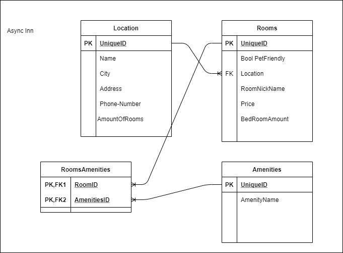

# Lab-Async-Inn
## Ben Hemann
### 04/05/2021

[Description of ERD](Assests/Description.txt "description")

# Lab 13
### 04/07/2021
Today we added in new structures to the lab. We removed the need to rely on the DbContext file and isntead created
some interface files and then created a service for them that used the methods we created in the interface to do the same thing that 
DbContext was doing. 

# Lab 14
### 04/08/2021
Routes: TBD
I started work on adding the routes and I added the task to create and delete amentities in the IRoom interface. 

# Lab 17 ---- Lab Async-Inn-Final

[Link to deployed Azure site](https://async-inn20210412190832.azurewebsites.net/index.html) 

This website is a WIP for a hotel chain.  
TODO: add more amenity functionality and finish work

