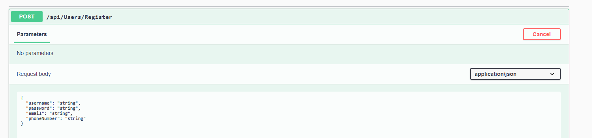

# Lab-Async-Inn
## Ben Hemann
### 04/05/2021

[Description of ERD](Assests/Description.txt "description")

# Lab 13
### 04/07/2021
Today we added in new structures to the lab. We removed the need to rely on the DbContext file and isntead created
some interface files and then created a service for them that used the methods we created in the interface to do the same thing that 
DbContext was doing. 

# Lab 14
### 04/08/2021
Routes: TBD
I started work on adding the routes and I added the task to create and delete amentities in the IRoom interface. 

# Lab 16
### 04/13/2021
Routes: TBD
Tried to start on the DTOs but not sure where I am at it

# Lab 17 ---- Lab Async-Inn-Final

[Link to deployed Azure site](https://async-inn20210412190832.azurewebsites.net/index.html) 

This website is a WIP for a hotel chain.  
TODO: add more amenity functionality and finish work

# Lab 18
### 04/14/2021  

In this lab I added login functionality with the ability to register.   
To do this, you need to hit the green arrow to run the lab, scroll down on Swagger until you see Register and Login.   
  
Open up the register tab and hit try me. Fill in the blanks on the form and hit execute.   

Then go to login. 

Fill out the form with the info you put in in register.   
Voli! You have registered and logged in. 

# Lab19
### 04/18/2021
This is the final iteration of this lab. It is sadly, not 100% working yet and I may come back. 
Lab description:  
Add 3 new roles to your application with the following permissions:  

District Manager  
District manager can do full CRUD operations on all Hotel, HotelRoom, Room, and Amenity entities.  
The district manager can create accounts for all other roles  

Property Manager  
Property Manager’s can add/update/read new HotelRooms to hotels, and amenities to rooms. A property manager cannot create new room entities or hotel entities.  
The property manager can only create accounts for Agents  

Agent  
An agent can only update/read a HotelRoom and add/delete amenities to rooms  
Anonymous users  
anonymous users can only view all GET routes  
All routes should be locked down to Authorize. Override the [AllowAnonymous]on the appropriate routes for anonymous users.  

I added the correct roles including an extra role. 